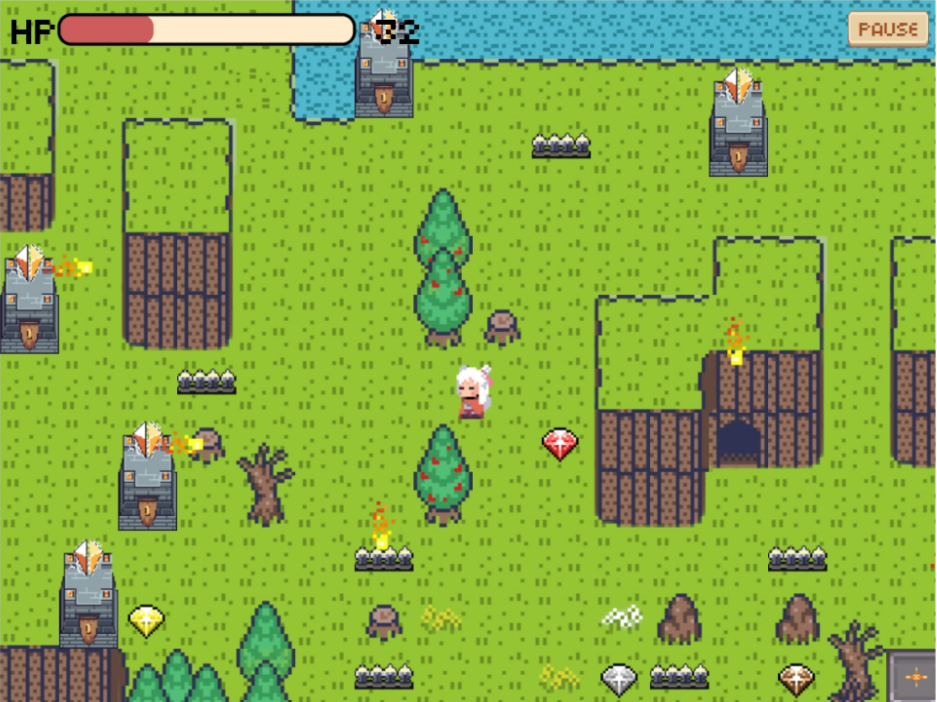

# 🪴GardenEscape
**GardenEscape** is a game developed in Java and JavaFX for the Final Project of Programming Methodology.

  This repository provides:
  - Source code
  - Resource files for GUI
  - JAR file
  - Project documentation

📺 Take a glimpse at the [PRESENTATION VIDEO](https://youtu.be/QsL_jymZl1w).

## 🪄Introduction


_You are lost in this mysterious garden._

> Hmm Where am I? Whoa! What is that? That little red thing is coming this way. 
> 
> It’s so gorgeous, maybe I can touch it. 
> 
> Ahhhhhh My hand is burning!!! This place is insane. 
> 
> I have to get out.

This Game is an 2D Role-playing game (RPG) in which the player has to go to the endpoint at the bottom-right by walking through the garden. But It’s not that simple. Let’s read this following rules.

**The rule :**
1. Walk wisely cause _**the more you walk the more HP decrease**_.
2. Beware of the _**fireball**_. Even if it’is magnificent, It can _**reduce your HP by 30**_.
3. Watch your step! If be careless, _**Your HP can instantly decrease by 40 from stepping on the trap.**_

_It’s that been too hard? 
This garden still have some kindness_  
✧ IF U SEE THE TWIKLE LITTLE STAR ✧  
**THAT’S A DIAMOND!!!!  
It can +15 HP**  

— You can move by using the arrow keyboard —

## ⚙️Installation 
To run a JAR file in the command prompt (CMD) with Java and JavaFX, follow these steps:

1. Make sure you have Java installed on your system. You can check this by typing `java -version` in the CMD. If Java is not installed, please download and install it from the official Java website.

2. Ensure that you have the JavaFX library installed on your system. If you haven't installed it yet, you can download it from the OpenJFX website.

3. Open the command prompt (CMD) and navigate to the root folder where the JAR file and the required dependencies are located. You can use the `cd` command to change directories. For example, if the JAR file is located in "C:\MyProject," you would type `cd C:\MyProject` in the CMD.

4. Once you are in the root folder, run the following command to execute the JAR file:

```
java -jar --module-path {JavaFX library path} --add-modules javafx.controls,javafx.fxml,javafx.media GardenEscape.jar
```

Make sure to replace `{JavaFX library path}` with the actual path to the JavaFX library on your system. If you installed JavaFX in the default location, the path may be similar to `"C:\Program Files\Java\javafx-sdk-19\lib"`. Also, ensure that the JAR file is named correctly (in this example, it is named "GardenEscape.jar").

Here's an example command:

```
java -jar --module-path "C:\Program Files\Java\javafx-sdk-19\lib" --add-modules javafx.controls,javafx.fxml,javafx.media GardenEscape.jar
```

By following these steps, you should be able to run the JAR file with the necessary JavaFX dependencies in the command prompt.
